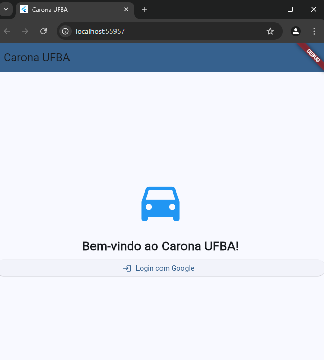
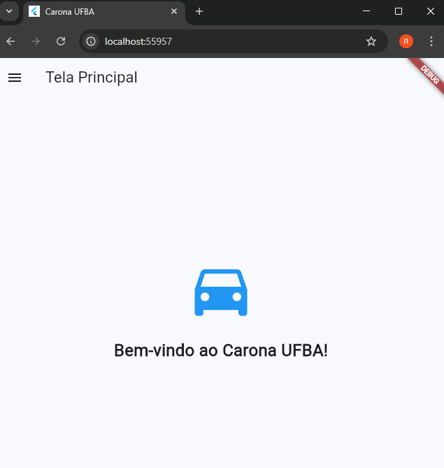
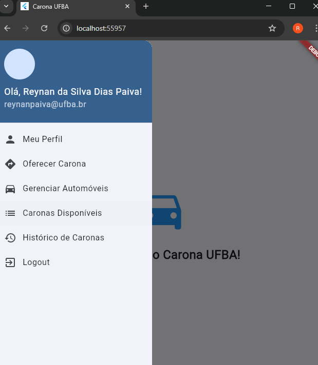
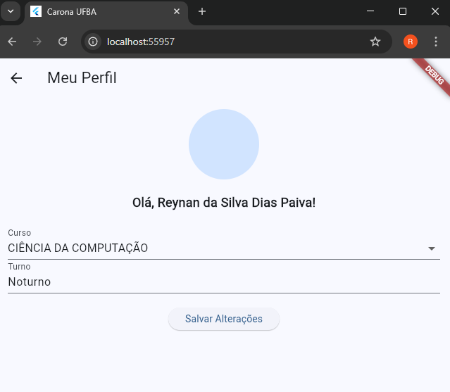
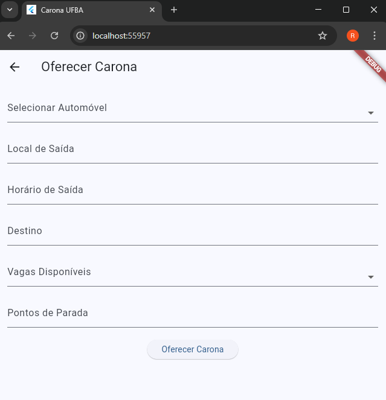
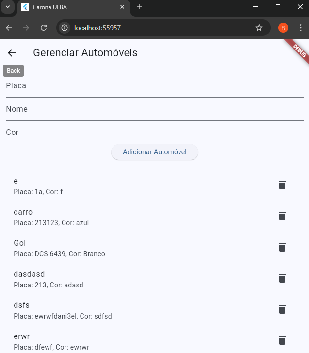
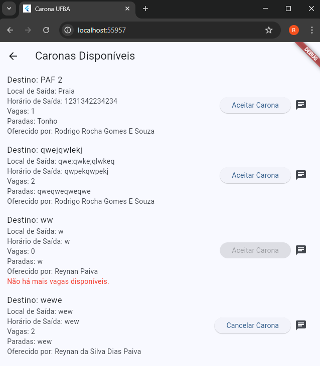
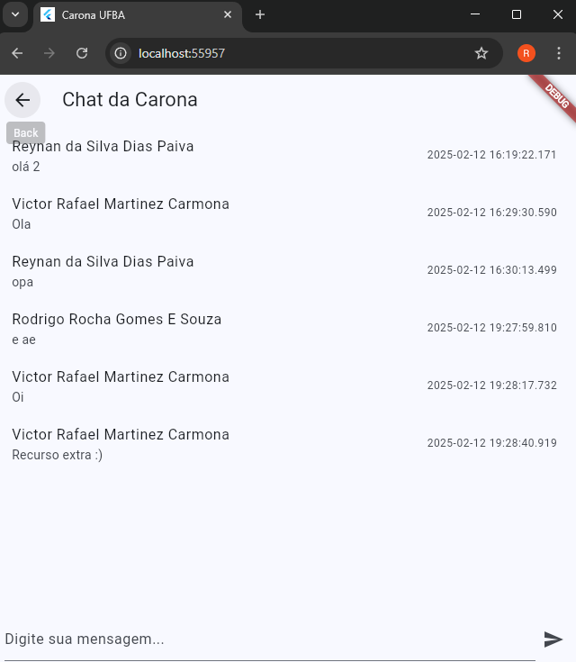
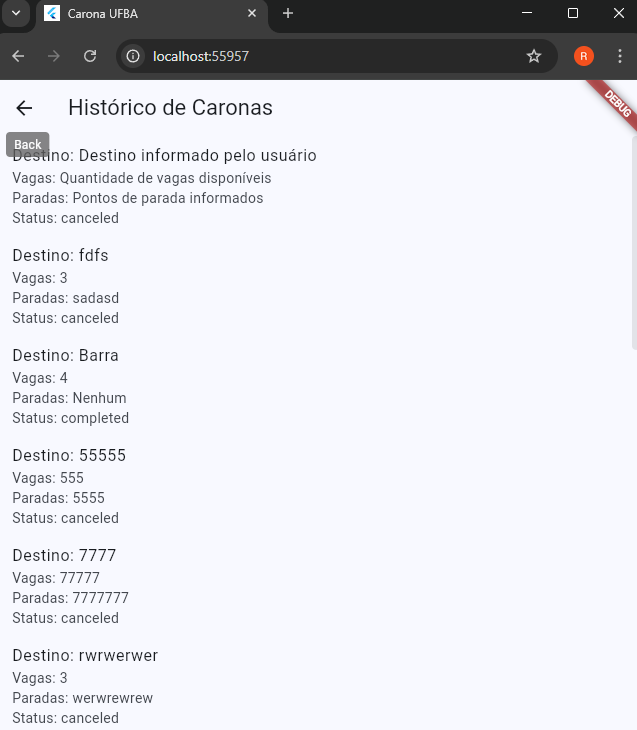

# Carona UFBA

Bem-vindo ao **Carona UFBA**, um aplicativo desenvolvido em **Flutter** para facilitar a organização de caronas na comunidade da UFBA. O sistema integra **Firebase** para autenticação, armazenamento de dados e gerenciamento em tempo real.

---

## Sumário
- [Funcionalidades](#funcionalidades)
- [Configuração](#configuração)
- [Estrutura do Projeto](#estrutura-do-projeto)
- [Tecnologias Utilizadas](#tecnologias-utilizadas)
- [Fluxo do Usuário](#fluxo-do-usuário)
- [Licença](#licença)
- [Desenvolvedor](#desenvolvedor)

---

## Funcionalidades
- **Autenticação via Google**  
  O usuário realiza login apenas com emails válidos (ex: `@ufba.br` ou `@gmail.com`).
  
- **Gestão de Perfil**  
  Atualize suas informações pessoais, como curso, turno e foto de perfil.

- **Gerenciamento de Automóveis**  
  Adicione, edite ou remova os automóveis que você utiliza para oferecer caronas.

- **Oferta de Caronas**  
  Configure o destino, número de vagas disponíveis (0 a 7) e pontos de parada, além de selecionar um automóvel previamente registrado.

- **Lista de Caronas Disponíveis**  
  Visualize todas as caronas disponíveis e aceite ou cancele caronas diretamente pelo aplicativo.

- **Histórico de Caronas**  
  Consulte caronas oferecidas ou aceitas anteriormente, com informações sobre destino, vagas e status.

---

## Configuração
1. Clone este repositório:
   ```bash
   git clone https://github.com/seu-usuario/carona-ufba.git
   cd carona-ufba## Passos para Configuração do Projeto

2. Instale as dependências:
   ```bash
   flutter pub get
   ```

3. Configure o Firebase:
   - Substitua o arquivo `firebase_options.dart` pelos dados gerados pelo setup do Firebase.

4. Execute o app:
   ```bash
   flutter run
   ```

---

## Estrutura do Projeto
- **lib/main.dart**  
  Arquivo principal com a inicialização do Firebase e as rotas principais.
  
- **Componente Principais:**
  - **`MyHomePage`**: Tela inicial com login.
  - **`MainScreen`**: Tela principal após o login.
  - **`ProfilePage`**: Gerenciamento do perfil do usuário.
  - **`CarManagementPage`**: Gerenciamento de automóveis.
  - **`RideOfferPage`**: Tela para oferecer novas caronas.
  - **`RideListPage`**: Lista de caronas disponíveis.
  - **`RideHistoryPage`**: Histórico de caronas.

---

## Tecnologias Utilizadas
- **Flutter**  
  Framework principal para desenvolvimento multiplataforma.
- **Firebase**  
  - **Authentication**: Login com Google.
  - **Realtime Database**: Armazenamento de dados (perfis, automóveis, caronas, histórico).
- **Dart**  
  Linguagem de programação utilizada pelo Flutter.
- **Material Design 3**  
  Interface moderna e responsiva.

---

## Fluxo do Usuário
1. **Login**  
   O usuário efetua login com a conta do Google.
2. **Tela Principal**  
   Acesso ao menu lateral para gerenciar dados e navegar nas telas.
3. **Oferecer Carona**  
   Seleciona automóvel, destino, vagas, pontos de parada.
4. **Lista de Caronas**  
   Exibe todas as caronas ativas. É possível aceitar ou cancelar (se for o dono).
5. **Histórico**  
   Exibe caronas finalizadas ou canceladas previamente.

---












---

## Licença
Este projeto está sob a licença [MIT](LICENSE). Sinta-se livre para utilizá-lo, modificá-lo e distribuir conforme permitido pelos termos da licença.

---

## Desenvolvedores
- **Nome:** [Reynan Paiva]
- **Nome:** [Victor Rafael]
  
Contribuições são bem-vindas!
